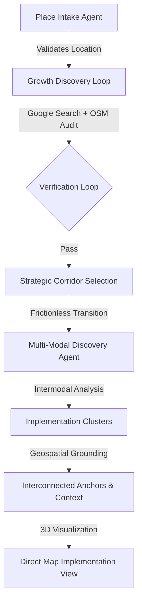

# National Transit Connectivity Agent (Malaysia)

## Core Idea
National Transit Connectivity Agent is an AI-assisted geospatial planning system for Malaysian transit improvement.  
It combines:
- growth-led area discovery,
- spatial gap validation from OpenStreetMap,
- multi-modal implementation discovery (Rail + Feeder Bus clusters),
- and direct-to-map geospatial discovery for decision support.

The core goal is to reduce weak or hallucinated recommendations by requiring evidence-backed challenge framing before downstream planning.

## System Architecture

### 1) Frontend (`public/`, `server.js`)
- Chat-first planning UI with staged workflow interactions.
- CesiumJS-based 3D visualization for:
  - proposed routes,
  - existing transit context,
  - simulation entities (vehicles, points, corridors, polygons).
- Direct Geospatial Discovery:
  - Frictionless transition from corridor selection to full-screen map implementation.
  - Multi-Modal Implementation Clusters: Visualizing primary rail anchors linked to first-mile feeder bus nodes.
  - Context Satellites: Automatic rendering of surrounding landmarks (Malls, Residential, Industry) for site justification.

### 2) Backend Orchestration (`backend/app.py`, `backend/agent.py`)
- FastAPI orchestration with session-based state machine.
- Multi-agent pipeline:
  - place intake,
  - growth signal collection,
  - area selection,
  - multi-modal cluster discovery (Interconnected Anchors).
- Feature-flagged growth flow (`GROWTH_FLOW_ENABLED`) with backward-safe fallback.
- Model selection centralized through environment variable (`PLANNER_MODEL`).

### 3) Evidence and Scoring Layer (`backend/evidence_pipeline.py`)
- Growth evidence collection and clustering into area options.
- **Verification Loop**: Automatically regenerates area candidates until they pass evidence thresholds (Confidence >= 0.68).
- Report-signal scoring (source tier + recency + corroboration).
- OSM transit-gap audit and data completeness scoring.
- Merged confidence calculation and gate logic before planning.

### 4) Spatial and Routing Layer (`backend/FindRoads.py`, `backend/building_agent_helper.py`)
- OSMnx/graph-based candidate route generation.
- Mode-aware weighting (drive/transit/walk).
- Route evidence extraction and geometry preparation.
- Geocoding + Overpass retrieval for map entity grounding.

## Agent Orchestration Workflow

The system uses a gated, multi-agent pipeline to ensure every planning intervention is grounded in real-world evidence.

### 1. Place Intake & Validation
- **Agent**: `place_intake_agent`
- **Goal**: Resolve natural language input into specific Malaysian coordinates and place names.
- **Output**: Validated `target_places`.

### 2. Growth Discovery & Verification (Pre-Selection)
- **Logic**: Automated loop in `start_area_option_phase`.
- **Action**: Performs parallel Google searches for growth signals and runs an **OSM Transit-Gap Audit** on every candidate.
- **Criteria**: Only presents 3 hotspots that meet basic feasibility and growth criteria.

### 3. Evidence Gating
- **Logic**: `compute_merged_confidence`.
- **Action**: Fuses "Soft Evidence" (Google reports) with "Hard Evidence" (OSM network density).
- **Result**: Generates a **Merged Evidence Summary** card with a strategic narrative.

### 4. Multi-Modal Cluster Discovery
- **Agent**: `find_hotspot_agent` + `Expert Planning Policy`.
- **Action**: Generates 3 spatially distinct implementation nodes. If a **Train Station** is proposed far from the problem source, a **Linked Feeder Bus Node** is automatically generated.
- **Visuals**: Dashed polylines connect the intermodal nodes, each surrounded by its own localized "Context Satellites."

## End-to-End Workflow
1. User provides target city.
2. System generates and verifies growth-led Strategic Corridors.
3. User selects a Strategic Corridor (e.g., Residential -> Central).
4. System **Directly Transitions** to the 3D Map view.
5. System identifies 3 Multi-Modal Implementation Clusters (Rail + Bus links).
6. Map automatically **Flys To** the primary implementation site.
7. User explores the Interconnected Anchors and their spatial justification markers.

## Find Needs Output Contract (Implemented)
Each of 3 challenge options is normalized to include:
- `title`
- `chart_spec` (SVG-ready bar chart data: `chart_type`, `labels`, `values`)
- `brief_description` (1-3 sentences)
- validated credible `sources` (HTTPS + allowed source tiers)

Compatibility fields for downstream pipeline are preserved:
- `CHALLENGE_THEME`
- `MACRO_ROOT_CAUSE`
- `WHY_IT_MATTERS`
- `EVIDENCE_SUMMARY`

## Key Components

### Backend
- `backend/app.py`
  - API endpoints (`/api/start`, `/api/chat`)
  - workflow state transitions
  - find-needs validation, repair, and fallback normalization
- `backend/agent.py`
  - all LLM agent definitions and prompts
- `backend/evidence_pipeline.py`
  - growth collection, clustering, scoring, and confidence merge
- `backend/FindRoads.py`
  - graph routing and route candidate construction
- `backend/building_agent_helper.py`
  - geospatial parsing and Cesium entity formatting

### Frontend
- `public/index.html`
  - chat interaction and stage rendering
  - evidence card + chart UI
  - map mode switching and impact panel handling
- `public/cesiumRenderer.js`
  - Cesium entity rendering helpers

## Agent Registry & Technical Connections

The National Transit Connectivity Agent operates as a "Swarm of Specialists," where each agent handles a specific diagnostic or planning domain.

### 1. Agent Specialist Registry

| Agent Name | Role | Core Task | Output Type |
| :--- | :--- | :--- | :--- |
| **Place Intake** | Gatekeeper | Validates Malaysian city inputs and ensures planning focus. | `VERDICT`, `PLACES` |
| **Growth Discovery** | Researcher | Extracts growth signals (Pop, Ind, Hubs) via Google Search. | `growth_findings` (JSON) |
| **Hotspot Agent** | Implementation | Discovers 3 spatially distinct Multi-Modal Anchors (Rail + Bus). | `implementation_clusters` |
| **Planning Policy** | Strategist | Mandates intermodal coupling (Feeder links) for rail infrastructure. | `linked_feeder` logic |
| **Contextualizer** | Geographer | Fetches localized POIs (Malls, Housing) for anchor justification. | `context_satellites` |
| **Building Agent** | Visualizer | Converts anchors & links into physics-based 3D CesiumJS entities. | `map_instructions` |

---

### 2. Technical Connectivity Pipeline

The system uses a **State-Machine Orchestration** in `app.py` to connect these agents:

1.  **Intake Phase**: `place_intake_agent` → `valid_places_text`.
2.  **Diagnostic Discovery**: `valid_places_text` → **Growth Discovery Agent** → `evidence_pipeline.py`.
    - *Connection*: The `evidence_pipeline` clusters raw search results into 3 **Area Options** with SVG growth charts.
3.  **The Evidence Gate**: User Choice → `audit_osm_transit_gap` (Hard Data) + `verify_complaint_against_osm` (Human Reports).
    - *Fusion*: Metrics are fused into a **Merged Confidence Score**.
4.  **Strategy Synthesis**: **Find Needs Agent** → **Hallucination Audit Agent**.
    - *Connection*: The Auditor compares the Agent's claims against the `google_evidence` stored in the session state to prevent fabrication.
5.  **Intervention Loop**: **Find Hotspot Agent** → `run_city_road_connection_analysis` → **Planning Agent**.
    - *Connection*: The Hotspot Agent provides road names; the Graph Analysis tool finds candidate paths; the Planning Agent chooses the optimal one.
6.  **Engineering Design**: **Planning Result** → **Solution Agent**.
    - *Connection*: Translates "Feeder Bus Route" into "Separated merge lanes" and "Station accessibility points."
7.  **Final Rendering**: **Solution Agent** → `building_agent_helper.py` → **Building Agent**.
    - *Connection*: Translates technical text into physics-based 3D entities (Points, Polylines, Polygons) for the CesiumJS map.

---

## Reliability and Fallback Behavior
- If growth discovery fails, synthetic area options are generated to keep flow alive.
- If find-needs output is invalid, backend attempts schema repair.
- If repair still fails, backend applies legacy/generic normalization to preserve 3 evidence cards.
- Existing plain-text formatting remains as final safety fallback.

## Environment Notes
- `PLANNER_MODEL`: shared model override for backend agents.
- `GROWTH_FLOW_ENABLED`: enable/disable growth-led pre-selection flow.
- `PLANNER_MODEL`: `gemini-3.1-flash-preview` or equivalent.

## Recent Updates (v2.3)
- **Multi-Modal Implementation paradigm**: Shift from diagnostic cards to direct site discovery on the map.
- **Interconnected Transit Anchors**: Automatic generation of feeder bus links for primary rail infrastructure.
- **Dual-Cluster Context**: Independent POI discovery for both main stations and feeder stops.
- **Frictionless Map Transition**: Automated selection bypass allows single-click 'Corridor to Map' workflow.
- **Intermodal Routing Hardening**: Fixed Overpass query syntax for consistent contextual landmark rendering.

